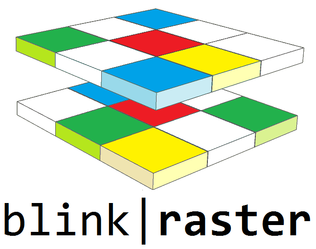

# Blink Raster Library

The Blink Raster Library is a C++ library to work with raster data. The core idea of the library is to make raster data accessible following the Range concept, making it possible to work with them using standard and modern C++ idioms. The library makes it straightforward to implement Map Algebra operations, including Moving Window analysis.

The library requires one of the following:
- GDAL, Boost (for Boost.Any, Boost.Filesystem and Boost.Optional) and C++11
- GDAL, C++17 (for std\::any, std\::filesystem and std\::optional)

See the [full documentation](./documentation/raster.md) for details.

   